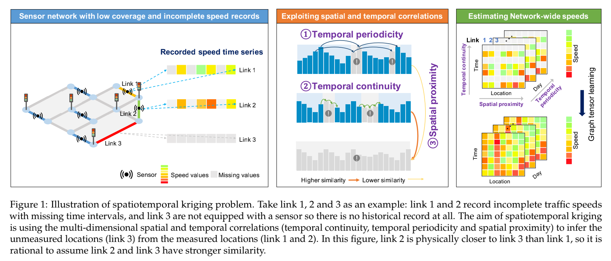
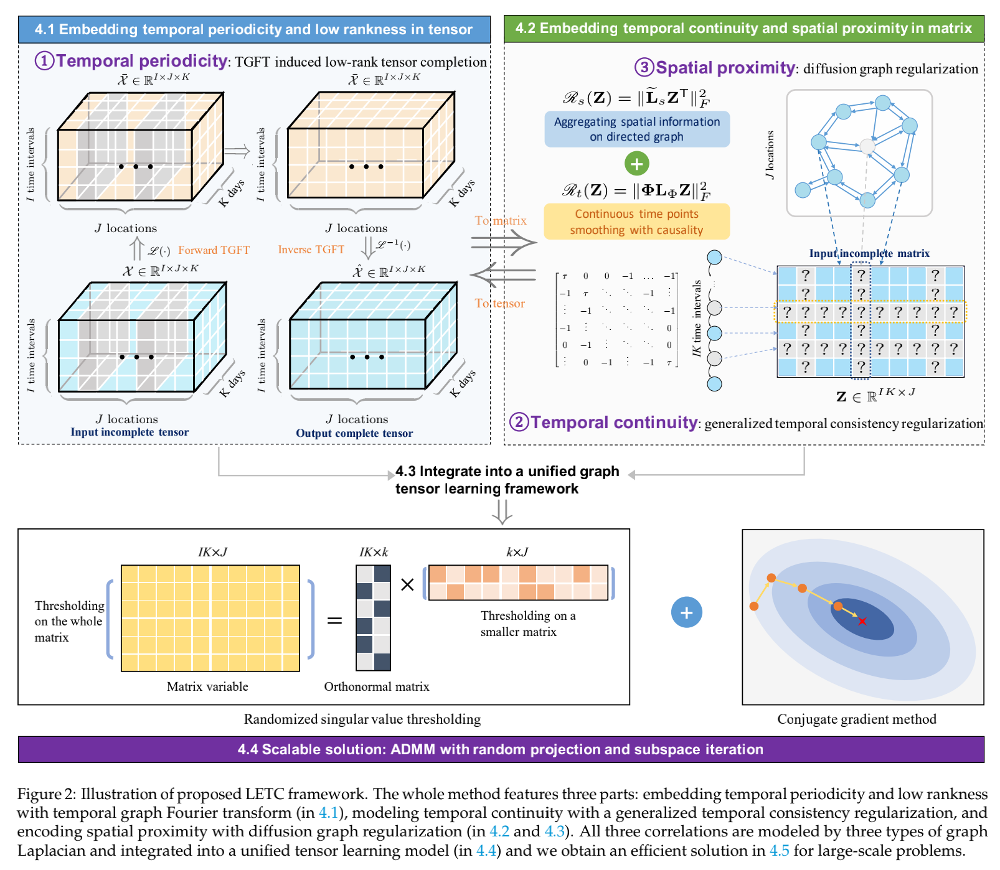
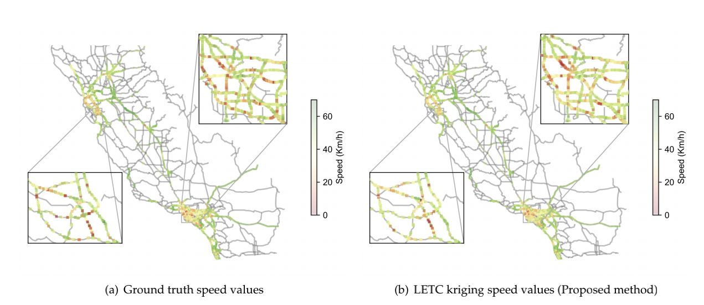

## Spatiotemporal Laplacian-enhanced low-rank tensor learning for large-scale traffic speed kriging with missing data

[](https://opensource.org/licenses/MIT)


📝
> This is the code repository for our paper ['Correlating sparse sensing for large-scale traffic speed estimation: A Laplacian-enhanced low-rank tensor kriging approach'](https://doi.org/10.1016/j.trc.2023.104190) that is published on Transportation Research Part C. The preprint version is available at [arXiv](https://arxiv.org/abs/2210.11780).


## Motivation
Traffic speed is central to characterizing the fluidity of the road network. Many transportation applications rely
on it, such as real-time navigation, dynamic route planning, and congestion management. However, due to sparse
deployment of static sensors or low penetration of mobile sensors, speeds detected are incomplete and far from
network-wide use. In addition, sensors are prone to error or missing data due to various kinds of reasons, speeds
from these sensors can become highly noisy. These drawbacks call for effective techniques to recover credible
estimates from the incomplete data. In this repository we demonstrated a **L**aplacian-**e**nhanced low-rank **t**ensor **c**ompletion (LETC) framework featuring both *low-rankness and multi-dimensional correlations* for large-scale traffic speed kriging under limited observations. To this end, two challenges are considered in this work:
- **Sparse sensor coverage**: only limited road links or locations are equipped with loop detectors;
- **Corrupted data measurements**: records at measured locations usually contain missing data at arbitrary time points or even entire time intervals.

<p align="center">

</p>


## Dataset
We adopt the large-scale PeMS-4W data to demonstrate how to implement LETC model to perform kriging with missing data imputation.
- **PeMS-4W**: Large-scale traffic speed data measured by 11160 static sensors from the [performance measurement system](https://pems.dot.ca.gov/) in California. The first four weeks of loop speed data with a 5-min window is pre-processed and available at [zenodo](https://zenodo.org/record/3939793).

Load graph information (first unzip the `.7z` file):

```python
def load_graph_data(pkl_filename):
    sensor_ids, sensor_id_to_ind, adj_mx = load_pickle(pkl_filename)
    return sensor_ids, sensor_id_to_ind, adj_mx

def load_pickle(pickle_file):
    try:
        with open(pickle_file, 'rb') as f:
            pickle_data = pickle.load(f)
    except UnicodeDecodeError as e:
        with open(pickle_file, 'rb') as f:
            pickle_data = pickle.load(f, encoding='latin1')
    except Exception as e:
        print('Unable to load data ', pickle_file, ':', e)
        raise
    return pickle_data

sid, sind, adj = load_graph_data('dataset/pems/adj_mat.pkl')
```

Prepare tensors and inject missing observations as well as unobserved links:

```python
import numpy as np
import pandas as pd

data_raw = pd.read_csv('dataset/pems/pems-4w.csv', header = None)
speed_mat = data_raw.values.T
print(speed_mat.shape)
```
The prepared spatiotemporal speed matrix is in the shape of time point $\times$ location.

## Model implementation

We resort to the *low-rank tensor completion (LRTC)* model to achieve full-scale traffic speed recovery. However, LRTC is hard to achieve kriging with low-rank assumption only. In our paper, we enhance LRTC with three Laplacian-induced correlations, i.e., **temporal periodicity (periodic Laplacian)**, **temporal continuity (circulant Laplacian)**, and **spatial proximity (diffusion Laplacian)**.

<p align="center">

</p>


Our model is based on a consise `NumPy` implementation on CPU devices, which is also applicable with `CuPy` on a GPU device. Some key operations are discussed as below:

Randomized singular value decomposition:
```python
def power_iteration(AA, Omega, power_iter = 1):
    Y = AA @ Omega
    for q in range(power_iter):
        Y = AA @ (AA.T @ Y)
    Q, _ = np.linalg.qr(Y)
    return Q

def rsvd(mat, Omega):
    A = mat.copy()
    Q = power_iteration(A, Omega)
    B = Q.T @ A
    u_tilde, s, v = np.linalg.svd(B, full_matrices = 0)
    u = Q @ u_tilde
    return u, s, v
```


Conjugate gradient method:
```python
def update_cg(var, r, q, Aq, rold):
    alpha = rold / np.inner(q, Aq)
    var = var + alpha * q
    r = r - alpha * Aq
    rnew = np.inner(r, r)
    q = r + (rnew / rold) * q
    return var, r, q, rnew

def ell_z(Z,Lc2,Lr2,rc,rr,mu):
    ell_z = rc*Z@Lc2 + rr*Lr2@Z +mu*Z
    return ell_z

def conj_grad_Z(C,Z,Lc2,Lr2,rc,rr,mu,maxiter = 3):
    dim1, dim2 = Z.shape
    z = np.reshape(Z, -1, order = 'F')
    r = np.reshape(C - ell_z(Z,Lc2,Lr2,rc,rr,mu), -1, order = 'F')
    q = r.copy()
    rold = np.inner(r, r)
    for it in range(maxiter):
        Q = np.reshape(q, (dim1, dim2), order = 'F')
        Aq = np.reshape(ell_z(Q,Lc2,Lr2,rc,rr,mu), -1, order = 'F')
        z, r, q, rold = update_cg(z, r, q, Aq, rold)
        
    return np.reshape(z, (dim1, dim2), order = 'F')
```


```python
def cal_graph_operator(L):
    eigenvalues,eigenvectors = np.linalg.eigh(L)
    inds = np.argsort(eigenvalues)
    U = eigenvectors[:,inds]
    
    return U

def GFT(tensor, U):
    return np.einsum('kt, ijk -> ijt', U, tensor)  #mode-3 product

def iGFT(tensor, U):
    return np.einsum('kt, ijt -> ijk', U, tensor)  #mode-3 product(transpose)
```

basic tensor operations:
```python
def TensorFromMat(mat,dim):
    #Construct a 3D tensor from a matrix
    days_slice = [(start_i,start_i + dim[0]) for start_i in list(range(0,dim[0]*dim[2],dim[0]))]
    array_list = []
    for day_slice in days_slice:
        start_i,end_i = day_slice[0],day_slice[1]
        array_slice = mat[start_i:end_i,:]
        array_list.append(array_slice)
        tensor3d = np.array(np.stack(array_list,axis = 0))
        tensor3d = np.moveaxis(tensor3d,0,-1)
        
    return tensor3d

    
def Tensor2Mat(tensor):
    #convert a tensor into a matrix by flattening the 'day' mode to 'time interval'.
    for k in range(np.shape(tensor)[-1]):
        if k == 0:
            stacked = np.vstack(tensor[:,:,k])
        else:
            stacked = np.vstack((stacked,tensor[:,:,k]))
    return stacked


def construct_Laplacian(adj):
    degree = np.diag(np.sum(adj,axis=1))
    temp = degree-adj
    if np.allclose(temp,temp.transpose()):
        Lap = temp.copy()
    else:
        print('Error Construction')
        Lap = None
    return Lap
```

```python
def tsvt_gft(tensor, Ug, ta,Omg,is_rsvd):
    dim = tensor.shape
    X = np.zeros(dim)
    tensor = GFT(tensor, Ug)
    for t in range(dim[2]):
        if is_rsvd==True:
            u, s, v = rsvd(tensor[:, :, t].T, Omg)
            r = len(np.where(s > ta)[0])
            if r >= 1:
                s = s[: r]
                s[: r] = s[: r] - ta
                X[:, :, t] = (u[:, :r] @ np.diag(s) @ v[:r, :]).T
        else:
            u, s, v = np.linalg.svd(tensor[:, :, t], full_matrices = False)
            r = len(np.where(s > ta)[0])
            if r >= 1:
                s = s[: r]
                s[: r] = s[: r] - ta
                X[:, :, t] = u[:, : r] @ np.diag(s) @ v[: r, :]
    return iGFT(X, Ug)
```

```python
def temporal_regularizer(T, tau):
    "shape: (T-tau)*T"
    ell = np.zeros(T)
    ell[0] = tau
    for k in range(tau):
        ell[k + 1] = -1
    return scipy.linalg.circulant(ell)[tau:,:]
```

## Example

Performing kriging on the California sensor network. We provide a toy example to demonstrate how to implement our model in this [notebook](https://github.com/tongnie/tensor4kriging/blob/main/demo/LETC-PeMS-example.ipynb).
Road network can be visualized using `geopandas` from `dataset/pems/shape_files`:
<p align="center">

</p>

Not limited to traffic data, LETC model can be applied to any customized or private spatiotemporal datasets (with a pre-defined graph) for missing data imputation or kriging! 

## Cite us

  >Please cite our paper if this repo helps your research.

#### Cited as:
bibtex:

```
@article{nie2023correlating,
  title={Correlating sparse sensing for large-scale traffic speed estimation: A Laplacian-enhanced low-rank tensor kriging approach},
  author={Nie, Tong and Qin, Guoyang and Wang, Yunpeng and Sun, Jian},
  journal={Transportation Research Part C: Emerging Technologies},
  volume={152},
  pages={104190},
  year={2023},
  publisher={Elsevier}
}
```

### Our Publications
--------------
- Tong Nie, Guoyang Qin, Yunpeng Wang, and Jian Sun (2023). **Towards better traffic volume estimation: Tackling both underdetermined and non-equilibrium problems via a correlation-adaptive graph convolution network**. arXiv preprint arXiv:2303.05660. [[Preprint](https://doi.org/10.48550/arXiv.2303.05660)] [[Code](https://github.com/tongnie/GNN4Flow)]

- Tong Nie, Guoyang Qin, Yunpeng Wang, and Jian Sun (2023). **Correlating sparse sensing for large-scale traffic speed estimation:
A Laplacian-enhanced low-rank tensor kriging approach**. Transportation Research Part C: Emerging Technologies, 152, 104190, [[Preprint](https://doi.org/10.48550/arXiv.2210.11780)] [[DOI](https://doi.org/10.1016/j.trc.2023.104190)] [[Code](https://github.com/tongnie/tensor4kriging)]

- Tong Nie, Guoyang Qin, and Jian Sun (2022). **Truncated tensor Schatten p-norm based approach for spatiotemporal traffic data imputation with complicated missing patterns**. Transportation research part C: emerging technologies, 141, 103737, [[Preprint](https://doi.org/10.48550/arXiv.2205.09390)] [[DOI](https://doi.org/10.1016/j.trc.2022.103737)] [[Code](https://github.com/tongnie/tensorlib)]


License
--------------

This work is released under the MIT license.
